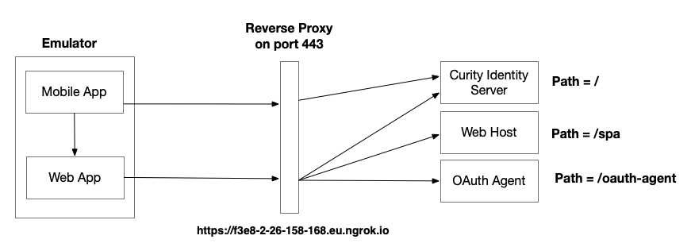

# OAuth Mobile Web Integration

Stub mobile and web apps to demonstrate the nonce authenticator pattern.

## Application Behavior

The mobile app signs the user in, using a standard mobile flow.\
Run either the Android or iOS app, then invoke a web view or integrated browser:

When the button is clicked, the mobile app creates a nonce using its ID token:

The web app can then run a guaranteed SSO flow using the nonce.

## Deployment

The development setup is implemented as follows, using Docker and ngrok:



Deploy the system with the following command:

```bash
deploy.sh
```

## External URLs

Internet URLs of the following form are available from a mobile emulator or device:

| Component | Internet URL |
| --------- | ------------ |
| Web Application | https://c7b9-2-26-158-168.eu.ngrok.io/spa |
| Curity Identity Server Runtime URL | https://c7b9-2-26-158-168.eu.ngrok.io |
