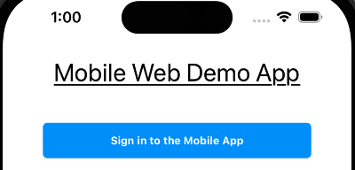
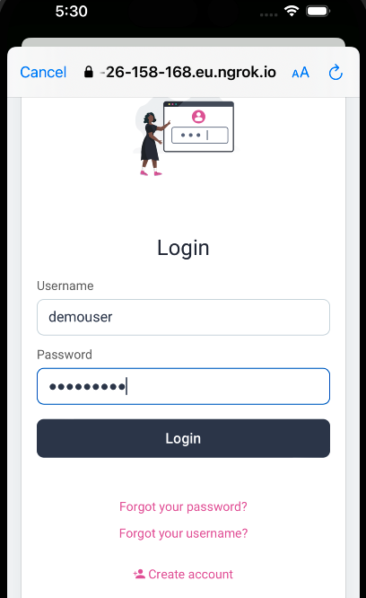
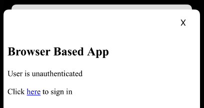
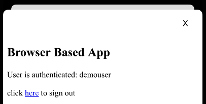

# OAuth Mobile Web Integration

Demo mobile and web apps to demonstrate the nonce authenticator pattern on a development computer.

## Run the Code Example

The following components are used, from a mobile emulator or device:


Build and deploy the system with the following commands:

```bash
./build.sh
./deploy.sh
```

A URL of the following form will be output:

```bash
The internet base URL is: https://c7b9-2-26-158-168.eu.ngrok.io
```

Applications running on mobile devices or emulators will then call these URLs:

| Component | Internet URL |
| --------- | ------------ |
| Web Application | https://c7b9-2-26-158-168.eu.ngrok.io/spa |
| Curity Identity Server Runtime URL | https://c7b9-2-26-158-168.eu.ngrok.io |

The Curity Identity Server Admin URL is at `http://localhost:6749/admin`.\
Sign into the Admin UI with credentials `admin / Password1` to understand the OAuth settings.

## Mobile Flow

Run either the Android or IOS app, and an unauthenticated view will be shown:



Click the login button and sign in as `demouser / Password1`.\



The authenticated view will then be presented, to navigate to a Single Page Application (SPA):


## Web Flow

The mobile app posts its ID token to the nonce authenticator in order to get a nonce.\
It then passes the nonce in a query string parameter to the web app:



To visualize behavior, the web app does an initial render to indicate that it must redirect.\
When the login link is clicked, the web app single signs on, without relying on shared cookies.\
This would be done automatically in a real web app:

