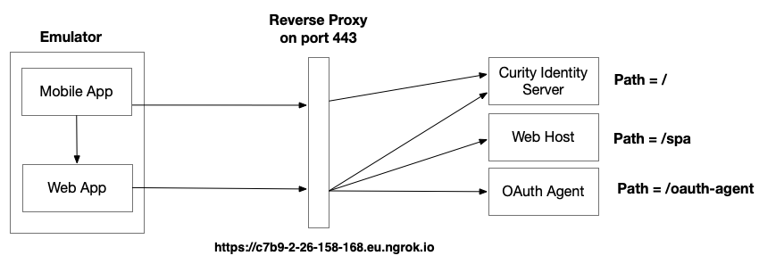
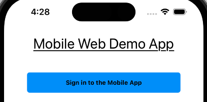
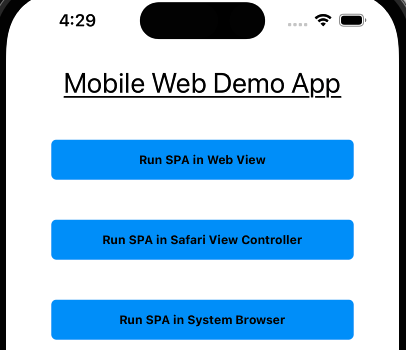

# OAuth Mobile Web Integration

Demo mobile and web apps to demonstrate the nonce authenticator pattern on a development computer.

## Run the Code Example

The following components are used, from a mobile emulator or device:



Build and deploy the system with the following commands:

```bash
./build.sh
./deploy.sh
```

A URL of the following form will be output:

```bash
The internet base URL is: https://c7b9-2-26-158-168.eu.ngrok.io
```

Applications running on mobile devices or emulators will then call these URLs:

| Component | Internet URL |
| --------- | ------------ |
| Web Application | https://c7b9-2-26-158-168.eu.ngrok.io/spa |
| Curity Identity Server Runtime URL | https://c7b9-2-26-158-168.eu.ngrok.io |

The Curity Identity Server Admin URL is at `http://localhost:6749/admin`.\
Sign into the Admin UI with credentials `admin / Password1` to understand the OAuth settings.\

## Application Flow

Run either the Android or IOS app, and an unauthenticated view will be shown:



Click the login button and sign in as `demouser / Password1`.\
The authenticated view will then be presented, to navigate to a Single Page Application (SPA):



A `nonce authenticator` is used, to avoid a second user login, and to enable the SPA to get its own tokens.