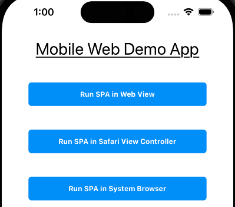

# OAuth Mobile Web Integration

Demo mobile and web apps to demonstrate the nonce authenticator pattern on a development computer.

## Run the Code Example

The following components are used, from a mobile emulator or device:


Build and deploy the system with the following commands:

```bash
./build.sh
./deploy.sh
```

A URL of the following form will be output:

```bash
The internet base URL is: https://c7b9-2-26-158-168.eu.ngrok.io
```

Applications running on mobile devices or emulators will then call these URLs:

| Component | Internet URL |
| --------- | ------------ |
| Single Page Application | https://c7b9-2-26-158-168.eu.ngrok.io/spa |
| Curity Identity Server Runtime URL | https://c7b9-2-26-158-168.eu.ngrok.io |

The Curity Identity Server Admin URL is at `https://localhost:6749/admin`.\
Sign into the Admin UI with credentials `admin / Password1` to understand the OAuth settings.

## Application Flow

Run the IOS app from Xcode, and an unauthenticated view will be shown:


Click the login button and sign in as `demouser / Password1`.


The authenticated view will then be presented, to navigate to a Single Page Application (SPA):



The mobile app posts its ID token to the nonce authenticator in order to get a one-time token.\
It then passes the nonce in a query string parameter to the SPA, when loading it in a browser.\
The SPA then authenticates silently with the nonce authenticator, using a hidden iframe:


## Website Documentation

See the following resources for further information:

- [Mobile Web Integration Tutorial](https://curity.io/resources/learn/mobile-web-integration-example)
- [Nonce Authenticator Pattern](https://curity.io/resources/learn/nonce-authenticator-pattern)
- [Nonce Authenticator Plugin](https://github.com/curityio/nonce-authenticator)

## More Information

Please visit [curity.io](https://curity.io/) for more information about the Curity Identity Server.
