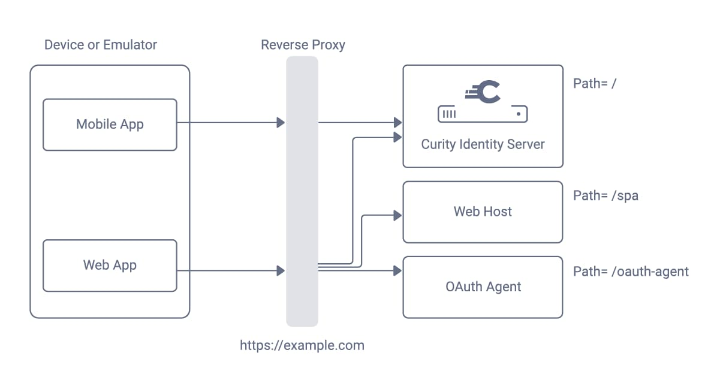

# OAuth Mobile Web SSO Code Example

Demo mobile apps and SPA, to demonstrate the nonce authenticator pattern on a development computer.

## Run the Code Example

The following components are called, from a mobile emulator or device.\
The SPA and OAuth agent are hosted on the same domain, behind a Docker based reverse proxy.\
This ensures that the HTTP-only cookies issued to the SPA are first-party:



Build and deploy the system with the following commands:

```bash
./build.sh
./deploy.sh
```

To enable a setup that works on a standalone computer, an ngrok base URL is used:

```bash
The internet base URL is: https://c7b9-2-26-158-168.eu.ngrok.io
```

Mobile and web apps running on devices or emulators then have full connectivity, over HTTPS URLs.\
The following URLs to backend components are used:

| Component | Internet URL |
| --------- | ------------ |
| Web Host | https://c7b9-2-26-158-168.eu.ngrok.io/spa |
| OAuth Agent | https://c7b9-2-26-158-168.eu.ngrok.io/oauth-agent |
| Curity Identity Server Runtime URL | https://c7b9-2-26-158-168.eu.ngrok.io |

The Curity Identity Server Admin URL is available at `https://localhost:6749/admin`.\
Sign into the Admin UI with credentials `admin / Password1` to understand the OAuth settings.

## Application Flow

Run the IOS app from Xcode, and an unauthenticated view will be shown:

| Android | iOS |
| ------- | --- |
|  | 

Click the login button and sign in as `demouser / Password1`.

| Android | iOS |
| ------- | --- |
|  | 

The authenticated view will then be presented, to enable navigation to a Single Page Application (SPA):

| Android | iOS |
| ------- | --- |
|  | 

The mobile app posts its ID token to the nonce authenticator in order to get a one-time token.\
It then passes the nonce in a query string parameter to the SPA, when loading it in a browser.\
The SPA then authenticates silently with the nonce authenticator, using a hidden iframe:

| Android | iOS |
| ------- | --- |
|  | 

## Website Documentation

See the following resources for further information:

- [Mobile Web SSO Code Example](https://curity.io/resources/learn/mobile-web-sso-example)
- [Nonce Authenticator Pattern](https://curity.io/resources/learn/nonce-authenticator-pattern)
- [Nonce Authenticator Plugin](https://github.com/curityio/nonce-authenticator)

## More Information

Please visit [curity.io](https://curity.io/) for more information about the Curity Identity Server.
